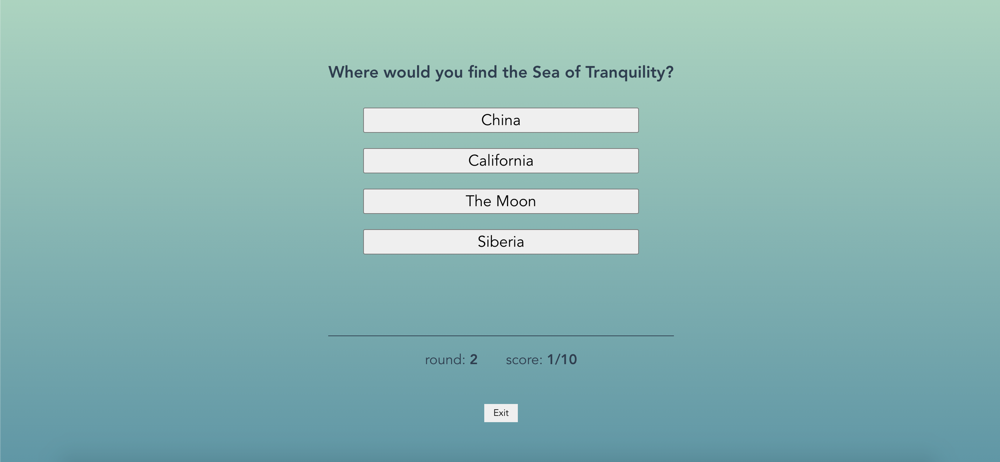

## 📙 trivia game  

## ✨ [play here](https://vue-trivia.vercel.app/) ✨

• • • • • •

## 📒 the challenge 
The goal was to create an application that displays trivia questions with multiple-choice answers to select from.
The questions & answers come in json format.

**intended MVP:**
the player can view the question(s), the answer choices, the correct answer upon submission, and their score. 

• • • • • •
#### tools

💚 Vue, JavaScript, & some minimalistic SCSS

• • • • • •
### ✅ intended MVP checklist

- [x] A round of trivia has 10 questions
- [x] All questions are multiple-choice questions
- [x] The score does not need to update in real time  (ok but it does:))
- [x] Results can update on form submit, button click, or any interaction
- [x] A user can view questions
- [x] Questions with their multiple choice options must be displayed one at a time
- [x] Questions should not repeat in a round
- [x] A user can select only 1 answer out of the 4 possible answers
- [x] The correct answer must be revealed after a user has submitted their answer
- [x] A user can see the score they received at the end of the round

• • • • • •

### 🔜 next steps 
*a few things I'd like to add when time allows* 

* router view fade in/out transitions 🆒
* the option to play 10 or 20 randomly selected questions 
* highlight/colorize answers instead of text feedback 🆒
* some sparkly animation to celebrate the correct answer
* more impressively styled buttons

• • • • • •

## [game on!](https://vue-trivia.vercel.app/)  😉
